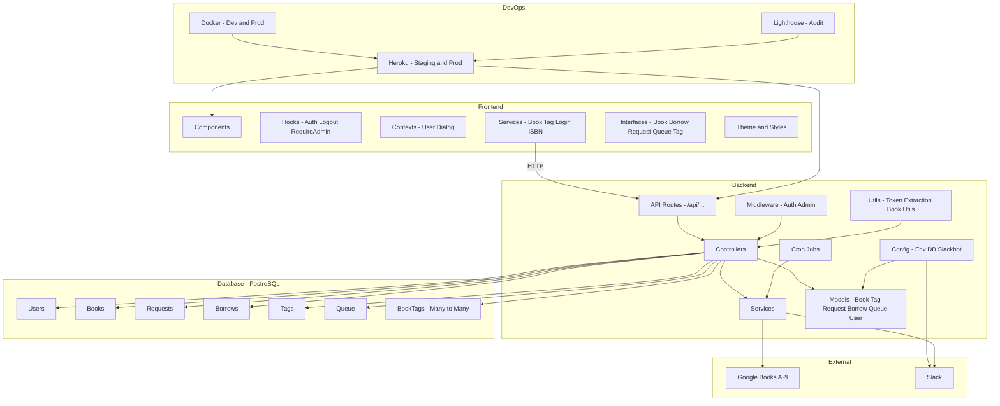

```mermaid
graph TD
  subgraph Frontend
    F1[Components]
    F2[Hooks - Auth Logout RequireAdmin]
    F3[Contexts - User Dialog]
    F4[Services - Book Tag Login ISBN]
    F5[Interfaces - Book Borrow Request Queue Tag]
    F6[Theme and Styles]
  end

  subgraph Backend
    B1[Controllers]
    B2[Services]
    B3[Middleware - Auth Admin]
    B4[Models - Book Tag Request Borrow Queue User]
    B5[Utils - Token Extraction Book Utils]
    B6[Cron Jobs]
    B7[Config - Env DB Slackbot]
    B8[API Routes - /api/...]

  end

  subgraph External
    GAPI[Google Books API]
    Slack[Slack]
  end

  subgraph DevOps
    Heroku[Heroku - Staging and Prod]
    Docker[Docker - Dev and Prod]
    Lighthouse[Lighthouse - Audit]
  end

  subgraph Database - PostreSQL
    DB1[Users]
    DB2[Books]
    DB3[Requests]
    DB4[Borrows]
    DB5[Tags]
    DB6[Queue]
    DB7[BookTags - Many to Many]
  end

  F4 -->|HTTP| B8
  B8 --> B1
  B1 --> B2
  B1 --> B4
  B2 --> GAPI
  B3 --> B1
  B5 --> B1
  B7 --> Slack
  B6 --> B2
  B7 --> B4
  B1 --> DB1
  B1 --> DB2
  B1 --> DB3
  B1 --> DB4
  B1 --> DB5
  B1 --> DB6
  B1 --> DB7
  B2 --> Slack

  Heroku --> F1
  Heroku --> B8
  Docker --> Heroku
  Lighthouse --> Heroku

```
